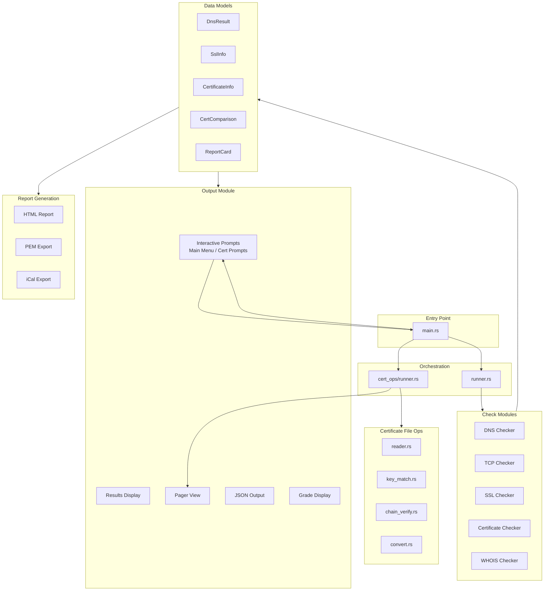
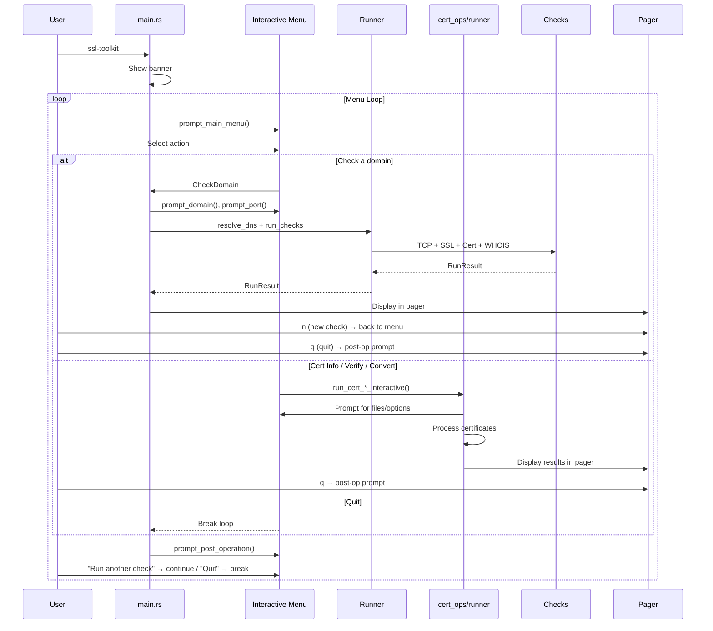
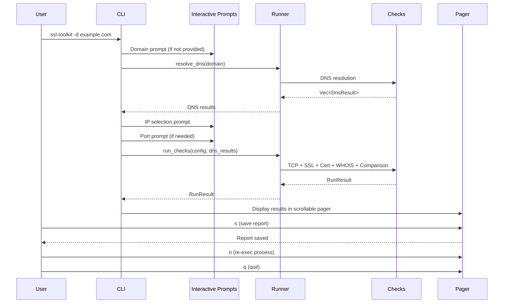

# SSL-Toolkit Architecture

## Overview

SSL-Toolkit is built using a modular architecture that separates concerns into distinct layers:



## Module Structure

### Entry Point (`src/main.rs`)

The main entry point handles:
- CLI argument parsing using Clap
- Configuration loading
- **Interactive menu mode**: When run with no arguments and a TTY is available, shows a banner and a top-level menu (Check a domain, Inspect certificate file(s), Verify certificate & key, Convert certificate format, Quit). After each operation, a post-operation prompt offers to return to the menu or quit.
- **Direct CLI mode**: When a domain is provided via `--domain` or a `cert` subcommand is used, skips the menu and runs the operation directly.
- Mode selection (interactive CLI, non-interactive, JSON, quiet)
- Top-level error handling

The menu loop delegates to:
- `run_domain_check_interactive()` for domain checks (results displayed in the ratatui pager; pager "n" key returns to menu)
- `cert_ops::runner::run_cert_info_interactive()` / `run_cert_verify_interactive()` / `run_cert_convert_interactive()` for certificate file operations (results displayed in the pager)

### CLI Module (`src/cli/`)

Defines command-line arguments using Clap derive macros:

```rust
#[derive(Parser)]
pub struct Cli {
    #[arg(short, long)]
    pub domain: Option<String>,

    #[arg(short, long)]
    pub ip: Option<IpAddr>,

    #[arg(short, long)]
    pub port: Option<u16>,

    #[arg(long)]
    pub json: bool,

    #[arg(short, long)]
    pub quiet: bool,

    #[arg(long)]
    pub non_interactive: bool,

    #[arg(short, long)]
    pub output: Option<PathBuf>,

    #[arg(short, long)]
    pub verbose: bool,

    #[arg(long)]
    pub skip_whois: bool,

    #[arg(long, default_value = "10")]
    pub timeout: u64,

    #[arg(long)]
    pub config: Option<PathBuf>,
}
```

### Configuration Module (`src/config/`)

Manages runtime configuration:
- **settings.rs**: DNS providers, SSL timeouts, WHOIS settings
- **theme.rs**: Icons, colors, visual indicators, box characters
- **messages.rs**: User-facing text templates

Configuration is loaded from TOML files with defaults.

### Runner Module (`src/runner.rs`)

The check orchestration engine that extracts check logic into a standalone async engine driven by any frontend.

```rust
pub struct RunConfig {
    pub domain: String,
    pub target_ips: Vec<IpAddr>,
    pub port: u16,
    pub settings: Settings,
    pub skip_whois: bool,
}

pub enum CheckEvent {
    DnsStarted,
    DnsComplete(Vec<DnsResult>),
    TcpStarted { ip: IpAddr },
    TcpComplete { ip: IpAddr, ms: f64 },
    SslStarted { ip: IpAddr },
    SslComplete { ip: IpAddr },
    CertStarted,
    CertComplete { days: i64 },
    ComparisonStarted { current: usize, total: usize, ip: IpAddr },
    ComparisonComplete,
    WhoisStarted,
    WhoisComplete,
    WhoisSkipped,
    Error(String),
}

pub struct RunResult {
    pub report: ReportCard,
    pub ssl_info: Option<SslInfo>,
    pub cert_info: Option<CertificateInfo>,
    pub cert_comparison: CertComparison,
    pub dns_results: Vec<DnsResult>,
}
```

Key functions:
- `resolve_dns()` - DNS resolution across all providers
- `run_checks()` - Runs TCP, SSL, certificate, WHOIS checks and certificate comparison

### Certificate File Operations (`src/cert_ops/`)

Handles offline certificate file operations (inspect, verify, convert). The runner (`cert_ops/runner.rs`) provides two layers:

- **CLI functions** (`run_cert_info`, `run_cert_verify`, `run_cert_convert`): Called from the `cert` subcommand, print output directly to stdout.
- **Interactive functions** (`run_cert_info_interactive`, `run_cert_verify_interactive`, `run_cert_convert_interactive`): Called from the main menu, prompt for inputs via `dialoguer`, collect `TestResult` objects, format them, and display in the ratatui pager.

Internal helpers `collect_cert_info()` and `collect_cert_verify()` separate result-building from output, enabling both paths to share the same logic.

### Check Modules (`src/checks/`)


Each check module follows a consistent pattern:

```rust
pub struct XxxChecker {
    // Configuration
}

impl XxxChecker {
    pub fn new(...) -> Self { ... }

    pub async fn check(&self, ...) -> Result<XxxInfo, XxxError> {
        // Perform check
    }
}
```

#### DNS Checker
- Uses `hickory-resolver` for async DNS lookups
- Supports multiple providers (System, Google, Cloudflare, OpenDNS)
- Returns `DnsResult` with addresses and timing

#### TCP Checker
- Simple TCP connection test with timeout
- Returns connection duration or error

#### SSL Checker
- Uses `rustls` for modern TLS (1.2, 1.3)
- Uses `native-tls` for legacy protocol detection
- Returns `SslInfo` with protocol, cipher, certificate chain, and `trust_verified`

#### Certificate Checker
- Uses `x509-parser` for certificate parsing
- Extracts subject, issuer, SANs, validity dates
- Validates certificate chain

#### WHOIS Checker
- Uses `whois-rust` with embedded node-whois `servers.json` for TLD server discovery
- Runs synchronous lookups in `spawn_blocking`
- Retries with exponential backoff
- Parses multiple WHOIS response formats (including Nominet `.uk` indented blocks)

### Data Models (`src/models/`)


### Output Module (`src/output/`)

Handles all CLI output formatting and user interaction:

- **banner.rs**: ASCII art banner display
- **interactive.rs**: Interactive prompts using `dialoguer`:
  - `prompt_main_menu()` — top-level menu (domain check, cert info/verify/convert, quit)
  - `prompt_post_operation()` — "Run another check" / "Quit" after each operation
  - `prompt_domain()`, `prompt_port()`, `prompt_ip_selection()` — domain check prompts
  - `prompt_cert_info_interactive()`, `prompt_cert_verify_interactive()`, `prompt_cert_convert_interactive()` — certificate file operation prompts
- **results.rs**: Formatted check result display with status icons and colored output
- **tables.rs**: Table formatting using `comfy-table`
- **grade.rs**: Visual grade display (A+ through F) with score bars
- **cert_chain.rs**: Certificate chain visualization
- **json.rs**: JSON output mode for scripting
- **pager.rs**: Ratatui-based scrollable viewer used for both domain check results and certificate file operation results

The interactive flow uses a menu loop: the main menu collects a choice, the chosen operation runs and displays results in the pager, then the post-operation prompt returns to the menu or quits.

### Report Module (`src/report/`)


Generates output files:
- **html.rs**: Self-contained HTML reports using minijinja
- **pem.rs**: PEM-formatted certificate chain export (excludes leaf)
- **ical.rs**: RFC 5545 compliant calendar reminders

### Utils Module (`src/utils/`)

Common utilities:
- **error.rs**: Custom error types using thiserror
- **progress.rs**: CLI progress indicators using indicatif

## Data Flow

### Interactive Menu Mode Flow (no arguments)



### Direct CLI Mode Flow (with --domain flag)



### Non-Interactive Mode Flow


## Error Handling

Uses a hierarchy of domain-specific errors:

```rust
pub enum ToolkitError {
    Dns(DnsError),
    Tcp(TcpError),
    Ssl(SslError),
    Certificate(CertificateError),
    Config(ConfigError),
    Report(ReportError),
    Whois(WhoisError),
    Io(std::io::Error),
}
```

Each error type provides detailed context for debugging.

## Async Architecture


Built on Tokio for async I/O:
- DNS queries are concurrent across providers
- TCP connections use async sockets
- TLS handshakes are async with timeout
- WHOIS uses spawn_blocking for sync library

## CI/CD Pipeline


### Release Workflow

The release pipeline uses GitHub Actions matrix builds to produce native binaries for each platform. Native compilation is required because `native-tls` links against platform-specific TLS libraries:

| Platform | Runner | TLS Backend | Artifact |
|----------|--------|-------------|----------|
| Linux x86_64 | `ubuntu-latest` | OpenSSL | `ssl-toolkit-linux-amd64` |
| macOS x86_64 | `macos-latest` | Security.framework | `ssl-toolkit-darwin-amd64` |
| macOS ARM64 | `macos-latest` | Security.framework | `ssl-toolkit-darwin-arm64` |
| Windows x86_64 | `windows-latest` | SChannel | `ssl-toolkit-windows-amd64.exe` |

Each build produces a binary and a `.sha256` checksum file. The release job collects all artifacts and creates a GitHub Release via `softprops/action-gh-release`.

### Homebrew Tap

A separate workflow (`.github/workflows/update-tap.yml`) fires on release publication. It downloads macOS checksums and updates the formula in the `homebrew-tap` repository. The artifact naming convention must remain consistent for this integration to work.

## Testing Strategy

1. **Unit Tests**: Each module has inline tests
2. **Integration Tests**: End-to-end tests with wiremock
3. **Test Domains**: Uses badssl.com for edge cases
4. **Manual Testing**: Cross-platform terminal testing
